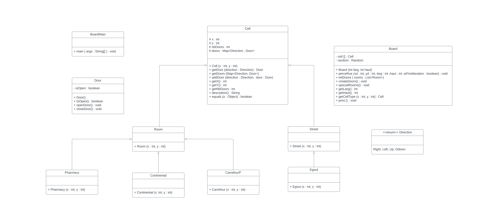
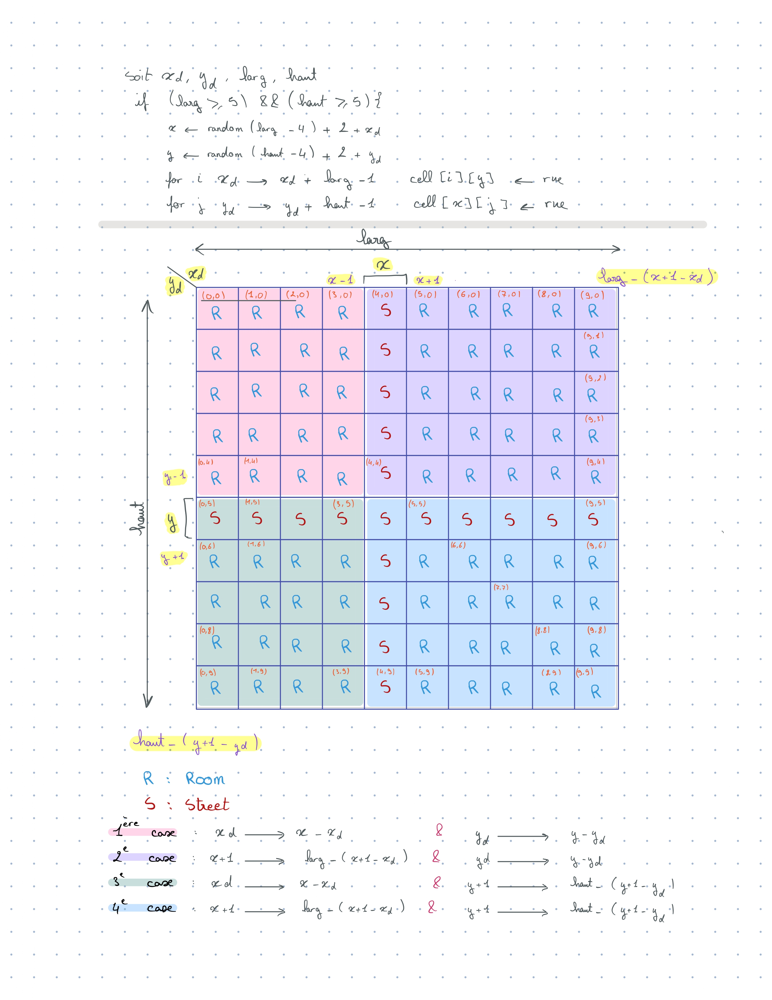
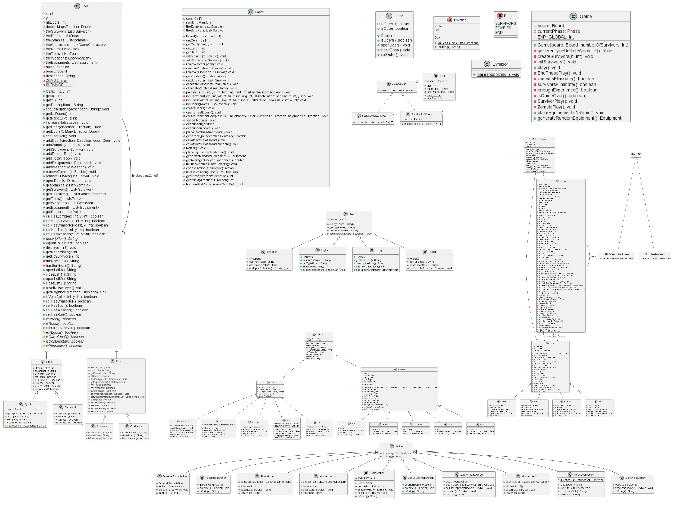

# l2s4-projet-2024

# Equipe

- ASMA BENYAHIA 
- TOKA ALABSI
- OMAYMA EL KADAOUI 
- RIM HACHICHA


# Sujet

[Le sujet 2024](https://www.fil.univ-lille.fr/~varre/portail/l2s4-projet/sujet2024.pdf)

# Livrables

## Livrable 1

UML LIVRABLE 1 : 

Algorithme de création : 

- Pour compiler : 
```javac -sourcepath src src/plateau/*.java -d classes```

- Pour exécuter : 
```java -classpath classes plateau.BoardMain 10 10```

- Exemple avec largeur et hauteur 10X10 :
```java -classpath classes plateau.BoardMain 10 10```

Plateau de jeu  :
```
 P  r  r |S| r  r  r |E| r  r  
 r  r  r |S| r  r  r |S| r  r  
 r  r  r |S| r  r  r |S| r  r  
|S||S||S||S||S||S||S||S| r  r  
 r  r  r |S| r  r  C |S||S||S| 
 r  r  r |S| r  r  r |S| r  r  
 r  r  r |S| r  r  r |S| r  r  
|E||S||S||S||S||S||S|CP|S||E| 
 r  r  r |S| r  r  r |S| r  r  
 r  r  r |S| r  r  r |E| r  r 
 
 ```

### Atteinte des objectifs
- Constructeur Board :
Crée un plateau de jeu avec une largeur "larg" et une hauteur "haut".
Utilise Random pour générer des valeurs aléatoires.
Remplit le plateau avec des instances de "Room" à chaque position.

- Méthode perceRue :
Génère des rues ("Street") aléatoirement sur le plateau, grâce à récursivité, les zones sont découpées par des rues  (voir schéma).
Aux extrémités des 2 rues principales (1 ère itération) sont placés les égouts.
Le carrefour principal "CarrefourP" est l’intersection des 2 rues principales.

- Méthode initDoors :
Initialise les portes pour chaque pièce (Room) sur le plateau, en les fermant par défaut.
Utilise createDoors pour créer les portes.
Parcourt chaque pièce et chaque direction (Right, Left, Up, Ddown).

- Méthode createDoors :
Crée des portes entre chaque cellule du plateau.
Pour chaque cellule du plateau, vérifie s’il existe déjà une porte dans une direction donnée, si non, crée une nouvelle porte.

- Méthode specialRooms :
Stock les pièces dans une liste et remplace 2 pièces aléatoires du plateau, une par « Continental » et une « Pharmacy ».

- Méthode getLarg, getHaut, getCellType :
Obtenir la largeur, la hauteur et le type de cellule (rue ou pièce).

- Méthode print :
Affiche le plateau de jeu.

### Difficultés restant à résoudre
- On a pas réussi a afficher correctement les portes donc on a laissé pour la semaine prochaine 
- On a eu un problème dans la compilation des tests 

### Evolution 
- modification des methodes de board et ajout des methodes private void +nomdeMethode pour ne pas avoir un long code d'une methode
- suppression de la methode print en la remplacant par la methode abstract description pour eviter de la changer a chaque fois qu'on rajoute une classe
- mettre junit-console.jar dans le fichier pour reussir a compiler et executer les test
- la classe CellTest est changée et on a reussis a compiler et executer sans probleme 

## Livrable 2

UML LIVRABLE 2 : 

- Pour compiler : 
```
javac -sourcepath src src/plateau/*.java -d classes
```
- Pour exécuter (exemple avec larg et haut 10x10) : 
```
java -classpath classes plateau.BoardMain 10 10
```

### Atteinte des objectifs

- Affichage des portes pour chaque case 
- Affichage de deux zombies avec deux types différents ( en utilisant la méthode description et ajout dans le main )
- Affichage de 2 zombies et 2 survivants (roles) et création de 2 équipements et 2 armes 

```   
Zombie z1 = new Abomination();
Zombie z = new Balaise();

Survivor s = new Survivor();

Keeper k = new Keeper("Kepper", 10);
Fighter k1 = new Fighter("Fighter", 1, 1);

Kit t = new Kit(9);
MasterKey t1 = new MasterKey(10);

board.getCell()[0][0].addZombie(z);
board.getCell()[0][0].addZombie(z1);
board.getCell()[1][1].addSurvivor(s);

board.getCell()[1][2].addRole(k);
board.getCell()[2][2].addRole(k1);

board.getCell()[4][2].addTool(t);
board.getCell()[2][4].addTool(t1);
```

##### Création de nouvelles classes : 

- Dans package plateau.gamecharacter :

Classes Survivor et Zombie qui héritent de la classe GameCharacter (pour tout les personnages du jeu avec les méthodes communes de des personnages)

Classe Role qui hérite de GameCharacter:
  - Pour les différents rôles des Survivor


Classes des différents types de :
- Dans package plateau.gamecharacter.zombie
  - Zombie :
     - Abomination
     - Balaise
     - Runner
     - Walker

- Dans package plateau.gamecharacter.role
  - Role :
     - Fighter 
     - Keeper
     - Lucky
     - Snooper
     

- Dans package plateau.equipment :

Classes Tool et Weapon qui héritent d Equipement (pour tout les équipements du jeu)

Classes des différents types de :
- Dans plateau.equipment.tool
  - Tool :
     - Card
     - HealingVial
     - Kit
     - MasterKey

- Dans plateau.equipment.weapon
  - Weapon :
    - Axe
    - Chainsaw
    - Crowbar
    - Pistol
    - Rifle 
    - Weapon


### Difficultés restant à résoudre
- on n'a pas réussi à ouvrir les portes entre les rues ( je pense que nous devons revoir les methodes creatDoors et initDoors)
- Pas d'affichage d'équipement ni d'arme et de survivants avec un rôle (on arrive à afficher quand pas de rôle)


## Livrable 3

UML LIVRABLE 3 : 

- Pour Compiler :
``` javac -sourcepath src src/plateau/*.java -d classes ```

- Pour Executer BoardMain :
``` java -classpath classes plateau.BoardMain 10 10 ```

- Pour Executer Livrable3 :
``` java -classpath classes plateau.Livrable3  ```

- Pour Compiler Test (Exemple FighterTest dans role):
``` javac -classpath junit-console.jar:classes test/plateau/role/FighterTest.java  ```

```
------------------------------
| P Z1| R   | E Z1| R   | R   |
|   S4|     |     |     |     |
------------     ------------
| R   | R   | S   | R   | R   |
|     |     |     |     |     |
------------     ------------
| E Z1  S     Cp    S     E Z1|
|                             |
------------     ------------
| R   | R   | S   | C   | R   |
|     |     |     |     |     |
------------------------------
| R   | R   | E Z1| R   | R   |
|     |     |     |     |     |
------------------------------
```

### Atteinte des objectifs

#### Actions ####

Les actions représentent les actions possibles que les personnages du jeu peuvent effectuer :
- AttackAction : permet à un survivant d'attaquer un zombie.

- HealerAction : permet à un survivant rendre 1 point de vie à un des
survivants dans sa zone (lui compris).

- MoveAction : permet à un survivant de se déplacer d'une zone à une autre.

- MakeNoiseAction : permet d'augmenter augmentant le niveau de bruit de la zone où se trouve le survivant

- OpenDoorAction :  permet à un survivant d'ouvrir une porte dans une direction spécifiée.

- SearchARoomAction : permet à un survivant de fouiller une pièce à la recherche d'équipements.

- TakeInHandAction : permet à un survivant de prendre un objet de son sac pour le placer dans sa main

- UseEquipment : permet à un survivant d'utiliser un équipement

##### Equipements #####
package plateau.equipment;

Les équipements représentent les objets que les survivants peuvent utiliser pour diverses actions. 

La classe Equipment est une classe qui représente un équipement. Elle définit les caractéristiques et le comportement de base que tous les équipements ont en commun.

Les classes Weapon et Tool héritent tout deux de cette classe, elles bénéficient de ses propriétés et méthodes tout en étant capables de définir leur propre comportement spécifique

##### Armes #####
package plateau.equipment.weapon;

La classe Weapon représente une arme avec des caractéristiques communes à toutes les armes. À partir de cette classe, nous avons créé des sous-classes pour chaque type d'arme spécifique, telles que Axe, Rifle,Pistol, Chainsaw, Crowbar. Chaque sous-classe d'arme implémente les détails spécifiques de cette arme particulière, tels que leurs lancers de dé, seuils, valeurs de dégât, portées.

##### Outils #####
package plateau.equipment.tool;

De manière similaire, la classe Tool représente un outil générique avec des propriétés communes à tous les outils. Nous avons également créé des sous-classes d'outils spécifiques pour différents types d'outils, tels que HealingVial, MasterKey, Card, Glasses et Kit. Chaque sous-classe d'outil implémente les fonctionnalités spécifiques de cet outil particulier, telles que les effets de guérison, les capacités de déverrouillage, etc.

### Difficultés restant à résoudre
- Les survivants placés dans la zone nord du carrefour pincipal se placent tous dans la même cellule

- On doit faire les tests pour les classes 

- Problème d'affichage pour les portes pour la ligne la plus basse du plateau (porte affichée fermée mais ouverte)

- Il nous manque à afficher l'état des survivants

- Exécuter l'action d’attaquer et de se déplacer pour chacun des zombies

## Livrable 4

UML LIVRABLE 4 : 

- Pour Compiler :
``` javac -sourcepath src src/plateau/*.java -d classes ```
- Pour Executer BoardMain :
``` java -classpath classes plateau.BoardMain 10 10 ```
- Pour Executer Livrable3 :
``` java -classpath classes plateau.Livrable3  ```
- Pour Executer Livrable4 :
``` java -classpath classes plateau.Livrable4 5 5 1  ```

### Atteinte des objectifs

- Il n’y a pas de zombies au départ : fait
- ⁠ La pharmacie est un lieu de ressourcement pour les survivants qui peuvent y prendre des fioles de guérison ( Pas fait )
- ⁠ La phase des survivants :
- ⁠ un survivant peut dépenser jusqu’à trois points d’action : fait
- ⁠ Il pourra en dépenser plus au fur et à mesure du jeu, suivant la manière dont évoluera son niveau d’expertise , le niveau d’expertise du survivant augmente à chaque fois qu’il tue un zombie et lorsque le Niveau expertise, franchi un palier, il réalise une action supplémentaire. Si le niveau expertise égal à trois ou sept ou 11 : on a ajouté expert dans attaque action et on a ajouté la condition If. Si on a le niveau expertise égal à t3,7ou11 , on a plus un point d’action
- ⁠-Lorsque le survivant meurt, il est éliminé du jeu : fait
- description des actions
- ⁠ exécuter une action coûte un point d’action : fait
- ⁠ certaines actions sont spécifiques : on a eu des difficultés pour relier les rôles des survivants avec les actions
- ⁠ regarder autour de soi : l’action fonctionne bien. Ça nous affiche si la porte d’une direction D est ouverte ou fermée et aussi le nombre de zombies et de survivant présent dans la cellule
- ⁠ ouvrir une porte: fonctionne bien. On a juste un problème d’affichage quand la direction est Down ou Right. La porte s’ouvre mais l’affichage ne change pas.
- ⁠ se déplacer : fonctionne bien. On a les survivants qui se déplacent selon une direction choisie d 
- ⁠ faire du bruit: fonctionne bien. On a bien + 1 dans le bruit de la cellule quand on exécute cette action.
- ⁠ fouiller une pièce des équipements qui tombent dans la rue, sont disparus et perdues du jeu : fait lorsqu’il fuit une pièce, le survivant, on peut ramasser un équipement et le remettre dans le sac à dos : si le sac à dos est rempli, le survivant peut jeter un équipement pour en prendre un nouveau: normalement fonctionne bien, mais on a pas eu le temps de changer la façon de choisir (choisir aléatoirement) , 
- ⁠ prendre en main : prendre un objet du sac à dos pour le placer dans sa main : fait
- ⁠ attaquer un zombie : fait et fonctionne bien. On a acheté la condition de choisir le zombie qui a le moins de points de vie et dans la même classe on a mis si le zombie est tué On ajoute un au niveau d’expertise
- ⁠ En ce qui concerne les rôles, on les a tous fait, mais on a eu un problème pour relier l’action avec les rôles, même si on a ajouté une méthode pour ajouter l’action spécifique de chaque rôle
- ⁠ pour la face, j’ai des zombies : Move et attack fonctionne bien.


### Difficultés restant à résoudre
- Relier Les roles avec les actions 
- L'affichage des portes quand ils s'ouvrent 
- Javadoc Pas tous verifiée 
- Les tests 

# Journal de bord

## Semaine 1
Dans cette semaine , on a commencé par faire l'UML pour la premiere partie du projet 

on a decidé de présenter le plateau du jeu (Board) sous formes de cases (classe Cell) avec les coordonnées X et Y ( largeur et longueur )

puis on a crée les classes Building ( immeuble ) et Street (rue) qui hérite de la classe  Cell
et aussi la classe Piece qui hérite de la classe Building ( on a décidé d'initialiser le nombre de porte à 4 portes )

On a aussi les deux classes Pharmacy et continental qui sont de type Room (elles heritent de classe Room).


## Semaine 2
Nous avons revu notre dyagramme UML , corrigé les erreurs et commencé à coder certaines classes .
en parallele , nous discutons de la meilleur façon de diviser le plateau , mais nous n'avons pas encore trouvé de solution définitive .

Nous supposons pour le plateau que c'est une cell[boardSize][boardSize] qui se divise donc en plusieurs cells[i][j] qui possèdent chacune une valeur attribuée allant de 1 à (boardSize)² pour former les cases du jeu.
Par exemple :
- cell[0][0] : 1
- cell[0][1] : 2    
etc .. 
- cell[4][4] : 25 (allant jusqu'à 25 par exemple pour le plateau 5*5)

Nous n'avons pas encore trouvé de solution pour placer les rues et pièces en fonction de ces valeurs.

## Semaine 3
Nous avons programmé l'algorithme de création.

Algorithme de création :
initialiser toutes les cases à Piece (r) et ensuite placer les rues (|S|) à l'aide de la récursivité:

Tant que la largeur et la hauteur prise sont supérieures à 5 alors on prend un random  x et un random y .

Pour le random x il va être entre xd+2 et larg-2+xd.
Pour le random y il va être entre yd+2 et haut-2+yd.
Après on fait deux boucle:
la première est pour tout j égale à yd, toutes les cases tel que cell[x][j] sont des cases rues. Pour le deuxième est pour tout i égale à xd, toutes les cases tel que cell[i][y] sont des cases rues.
Ensuite on utilise la récurisivité pour diviser sur 4 en rappelant la fonction 4 fois . 

- Ajout des bouches d'égout (E) aux êtrémités des deux rues principales (formées à la première itération de perceRue)

- Ajout du carrefour principal (CP) à l'intersection des deux rues principales.

## Semaine 4
- On a créé un package room (pour mettre les classes Room , Pharmacy et Continental ) et un package street (pour les classes Street , Egout et CarrefourP) 
- On a corrigé chacune des classes pour pouvoir afficher correctement les bouches d'égout et le carrefour principal 
- On a reussi a afficher Pharmacy (P) et Continental (C) sur le plateau (en utilisant random on choisit 2 pièces qu'on remplace, une par Pharmacy, l'autre par Continental)
- Crée quelques méthodes de tests 
- On cherche comment affciher les portes correctement 

## Semaine 5
- Les points vus avec le prof en TP corrigés:
 * Modification des méthodes de Board et ajouter des méthodes private void +nomdeMethode pour ne pas avoir un long code d'une méthode 
 * Suppression de la méthode print en la remplacant par description pour éviter de la changer à chaque fois qu'on ajoute une classe 
 * Mettre junit-console.jar dans le fichier pour réussir a compiler et exécuter les test 
 * la classe CellTest est changée et on a reussi à compiler et executer 

``` 
javac -classpath junit-console.jar:classes test/plateau/CellTest.java
elkadaoui@elkadaoui-Latitude-7280:~/Documents/Projet/l2s4-projet-2024$ java -jar junit-console.jar -classpath test:classes -select-class plateau.CellTest

Thanks for using JUnit! Support its development at https://junit.org/sponsoring

╷
├─ JUnit Jupiter ✔
│  └─ CellTest ✔
│     ├─ testAddDoor() ✔
│     ├─ testGetX() ✔
│     ├─ testGetY() ✔
│     ├─ testCellInitialization() ✔
│     ├─ testGetDoor() ✔
│     └─ testGetNbDoors() ✔
├─ JUnit Vintage ✔
└─ JUnit Platform Suite ✔

Test run finished after 111 ms
[         4 containers found      ]
[         0 containers skipped    ]
[         4 containers started    ]
[         0 containers aborted    ]
[         4 containers successful ]
[         0 containers failed     ]
[         6 tests found           ]
[         0 tests skipped         ]
[         6 tests started         ]
[         0 tests aborted         ]
[         6 tests successful      ]
[         0 tests failed          ]
```
* Ajout de méthode dans BoardTest , executé et compilé 
``` /l2s4-projet-2024$ javac -classpath junit-console.jar:classes test/plateau/*.java
/l2s4-projet-2024$ java -jar junit-console.jar -classpath test:classes -select-class plateau.BoardTest

Thanks for using JUnit! Support its development at https://junit.org/sponsoring

╷
├─ JUnit Jupiter ✔
│  └─ BoardTest ✔
│     ├─ testBoardCreation() ✔
│     ├─ testCreateDoors() ✔
│     ├─ testGetCell() ✔
│     ├─ testGetHaut() ✔
│     ├─ testGetLarg() ✔
│     ├─ perceRueTest() ✔
│     └─ testInitDoors() ✔
├─ JUnit Vintage ✔
└─ JUnit Platform Suite ✔

Test run finished after 133 ms
[         4 containers found      ]
[         0 containers skipped    ]
[         4 containers started    ]
[         0 containers aborted    ]
[         4 containers successful ]
[         0 containers failed     ]
[         7 tests found           ]
[         0 tests skipped         ]
[         7 tests started         ]
[         0 tests aborted         ]
[         7 tests successful      ]
[         0 tests failed          ]

```


Classe zombie : ajout d'attributs commun pour tous les zombies (dégâts infligés et points de vie). 
Ajout des méthodes pour attaquer(à modifier pour attaquer un survivant au hasard), infliger des dégâts, se déplacer en fonction du bruit 

Sous-classes de zombies pour les différents types : Walker, Runner, Balaise et Abomination avec leurs attributs spécifiques

classe Zone pour gérer les zones avec le bruit

Classe Survivor: 
- ajout d'attributs commun pour tous les survivors 
- ajout des signatures des methodes avec certins un peu de code 

Sous-classes de survivors pour pour les differents types :Keeper, Lucky, Fighter et Snooper


## Semaine 6
* Ajout des methodes en relation avec survivor et zimbie dans la classe Cell 
* Ajout de methode noiseLevel dans cell et dans equipement vu que dans chaque zone on a un bruit et aussi pour chaque equipement on a un bruit , et on a aussi des equipements qui sont silencieux ( à rajouter dans le code )
*  Ajout de methode dans survivors en relation avec equipement : ajouter un equipement dans le sac a dos , un boolean pour savoir si le sac est remplis ou pas , ...
* Ajour de la classe Role.java ( Les survivants peuvent avoir des rôles particuliers qui leur sont attribués au début de la partie)

## Semaine 7
- Ajout des methodes en relation avec survivor et zimbie dans la classe Cell 
- Ajout de la partie Evolution dans le livrable 1
- Essais de plusieurs fonctions pour afficher les portes pour arriver finalement au résultat suivant :
``` /l2s4-projet-2024$ javac -sourcepath src src/plateau/*.java -d classes
/l2s4-projet-2024$ java -classpath classes plateau.BoardMain 5 5
Plateau de jeu  :
 P   R   E   R   R 
 R   R   S   R   R  
 E   S   Cp  S   E  
 R   R   S   R   C  
 R   R   E   R   R  

_________________________
| P  | R  | E  | R  | R  |
|    |    |    |    |    |
_________________________
| R  | R  | S  | R  | R  |
|    |    |    |    |    |
_________________________
| E  | S  | Cp | S  | E  |
|    |    |    |    |    |
_________________________
| R  | R  | S  | R  | C  |
|    |    |    |    |    |
_________________________
| R  | R  | E  | R  | R  |
|    |    |    |    |    |
_________________________

```


## Semaine 8

- Affichage le nombre de zombies Dans chaque case avec (en bas) des explications sur le Type de zombies ( en Attendant Equipement et Survivors...)

``` javac -sourcepath src src/plateau/*.java -d classes
/l2s4-projet-2024$ java -classpath classes plateau.BoardMain 5 5
Plateau de jeu  :
 P   R   E   C   R  
 R   R   S   R   R  
 E   S   Cp  S   E  
 R   R   S   R   R  
 R   R   E   R   R  

------------------------------
| P Z2| R   | E   | C   | R   |
|     |     |     |     |     |
------------------------------
| R   | R   | S   | R   | R   |
|     |     |     |     |     |
------------------------------
| E   | S   | Cp  | S   | E   |
|     |     |     |     |     |
------------------------------
| R   | R   | S   | R   | R   |
|     |     |     |     |     |
------------------------------
| R   | R   | E   | R   | R   |
|     |     |     |     |     |
------------------------------

Les zombies présents dans la case 1 sont Abomination et Balaise
 ```

 - Affichage d'un zombie dans une case choisie dans le Main 

 ```   javac -sourcepath src src/plateau/BoardMain.java -d classes
/l2s4-projet-2024$ java -classpath classes plateau.BoardMain 5 5
Plateau de jeu  :
plateau.Board@36baf30c
 P   R   E   R   R  
 R   R   S   R   R  
 E   S   Cp  S   E  
 R   C   S   R   R  
 R   R   E   R   R  

------------------------------
| P Z2| R   | E   | R   | R   |
|     |     |     |     |     |
------------------------------
| R   | R   | S   | R   | R   |
|     |   S1|     |     |     |
------------------------------
| E   | S   | Cp  | S   | E   |
|     |     |     |     |     |
------------------------------
| R   | C   | S   | R   | R   |
|     |     |     |     |     |
------------------------------
| R   | R   | E   | R   | R   |
|     |     |     |     |     |
------------------------------

Les zombies présents dans la case 1 sont : Abomination et Balaise
```

## Semaine 9
- On a toujours pas réussi à afficher les Tool,Weapon et les Survivor avec un Role on ne trouve pas d'où vient le problème car les Zombie et Survivor sans rôle s'affichent 

- Création de méthode openStreetDoors pour ourvrir les portes entre les cases Street, pas encore totalement terminée,
certaines portes entre Street et Room s'ouvrent aussi 
```
------------     ------------
| P Z2| R     E   | R   | R   |
|     |           |     |     |
------------     ------------
| R   | R     S   | R   | R   |
|     |   S1      |     |     |

  E     S     Cp    S     E   |
                              |
------------     ------------
| R   | C     S   | R   | R   |
|     |           |     |     |
------------     ------------
| R   | R     E   | R   | R   |
|     |           |     |     |
------------------------------
```
##### Méthodes pour les actions des personnages :
- neighbourChoose : utilisation de list chooser, pour choisir un survivant

- méthode attack pour zombie qui permet à un zombie d'attaquer aléatoirement un survivor dans la même zone que lui

- méthode zombieAction pour déterminer l'action d'un zombie, soit il attaque si'il y a des survivors, soit il se déplace(vers la zone la + bruyante)

- modification de isBlocked (le déplacement de zombie est bloqué lorsqu'il arrive devant une porte) en fonction de la cellule voisine  : getNeighbor à faire


## Semaine 10
UML à jour 

- openStreetDoors fonctionne il y a juste un problème au niveau de l'affichage (Entre l'égout du bas 'E' et la case Rue 'S' du dessus la porte est ouverte mais s'affiche fermée)

```
------------------------------
| P Z2| R   | E   | C   | R   |
|     |     |     |     |     |
------------     ------------
| R   | R   | S   | R   | R   |
|     |   S1|     |     |     |
------------     ------------
| E     S     Cp    S     E   |
|                             |
------------     ------------
| R   | R   | S   | R   | R   |
|     |     |     |     |     |
------------------------------
| R   | R   | E   | R   | R   |
|     |     |     |     |     |
------------------------------
la porte en bas de la cell [3][2] est ouverte true
```
(System.out.println("la porte en bas de la cell [3][2] est ouverte " + board.getCell()[3][2].getDoor(Direction.Down).IsOpen());) 

- ajout de list chooser

- ajout de la classe Action + méthode abstraite execute pour gérer toutes les actions des survivors 

- ajout de la classe HealingVialAction pour l'action de la fiole de guérison en utilisant le useBy de la classe HealingVial

- proposition de méthode useBy dans Survivor à finir 

- ajout de la classe Move + methode execute qui permet au survivant de se déplacer vers une direction spécifique 

- ajout de la méthode useWeap dans la classe Weapon (utiliser une arme sur un zombie)

- ajout de quelques méthodes dans Survivor pour obtenir tous les équipements, vérifier leur présence et les retirer avec une liste pour les équipment et une liste pour les armes.

## Semaine 11

## Semaine 12

- ENFIN LE BON AFFICHAGE DES PORTES ( on arrivait pas à ouvrir les portes de des cellules de la dernière ligne)

``` 
/l2s4-projet-2024$ java -classpath classes plateau.Livrable3 
Ville d'entraînement  :
Plateau de jeu  :
plateau.Board@27716f4
 P   C   E   R   R  
 R   R   S   R   R  
 E   S   Cp  S   E  
 R   R   S   R   R  
 R   R   E   R   R  

------------------------------
| P Z1| C   | E Z1| R   | R   |
|     |   S4|     |   S1|   S1|
------------     ------------
| R   | R   | S   | R   | R   |
|     |     |     |   S1|   S1|
------------     ------------
| E Z1  S     Cp    S     E Z1|
|                             |
------------     ------------
| R   | R   | S   | R   | R   |
|     |     |     |     |     |
------------     ------------
| R   | R   | E Z1| R   | R   |
|     |     |     |     |     |
------------------------------

```

- Exemple Avec Larg et Haut 6 6 

``` ------------------------------------
| P Z1| R   | R   | E Z1| R   | R   |
|     |     |     |   S1|   S1|     |
------------------     ------------
| R   | R   | R   | S   | C   | R   |
|     |     |   S4|   S1|   S1|     |
------------------     ------------
| R   | R   | R   | S   | R   | R   |
|     |     |     |     |     |     |
------------------     ------------
| E Z1  S     S     Cp    S     E Z1|
|                                   |
------------------     ------------
| R   | R   | R   | S   | R   | R   |
|     |     |     |     |     |     |
------------------     ------------
| R   | R   | R   | E Z1| R   | R   |
|     |     |     |     |     |     |
------------------------------------
```


- Voila ce que me donne en executant :
```  Equipement ajouté est   a la case : x=0 y= 0
 Equipement ajouté est   a la case : x=0 y= 0
 Equipement ajouté est   a la case : x=0 y= 1
 Equipement ajouté est   a la case : x=0 y= 1
 Equipement ajouté est   a la case : x=0 y= 3
 Equipement ajouté est HealingVial a la case : x=0 y= 4
 Equipement ajouté est HealingVial a la case : x=0 y= 4
 Equipement ajouté est   a la case : x=0 y= 4
 Equipement ajouté est   a la case : x=1 y= 0
 Equipement ajouté est   a la case : x=1 y= 0
 Equipement ajouté est   a la case : x=1 y= 0
 Equipement ajouté est   a la case : x=1 y= 1
 Equipement ajouté est   a la case : x=1 y= 3
 Equipement ajouté est   a la case : x=1 y= 3
 Equipement ajouté est   a la case : x=1 y= 3
 Equipement ajouté est   a la case : x=1 y= 4
 Equipement ajouté est HealingVial a la case : x=1 y= 4
 Equipement ajouté est HealingVial a la case : x=1 y= 4
 Equipement ajouté est Axe a la case : x=3 y= 0
 Equipement ajouté est   a la case : x=3 y= 1
 Equipement ajouté est   a la case : x=3 y= 3
 Equipement ajouté est   a la case : x=3 y= 3
 Equipement ajouté est Axe a la case : x=3 y= 3
 Equipement ajouté est   a la case : x=3 y= 4
 Equipement ajouté est Axe a la case : x=3 y= 4
 Equipement ajouté est   a la case : x=4 y= 0
 Equipement ajouté est   a la case : x=4 y= 0
 Equipement ajouté est   a la case : x=4 y= 0
 Equipement ajouté est   a la case : x=4 y= 1
 Equipement ajouté est HealingVial a la case : x=4 y= 3
 Equipement ajouté est   a la case : x=4 y= 3
 Equipement ajouté est   a la case : x=4 y= 3
 Equipement ajouté est   a la case : x=4 y= 4
 Equipement ajouté est   a la case : x=4 y= 4
 Equipement ajouté est   a la case : x=4 y= 4
 Equipement ajouté est HealingVial a la case : x=0 y= 0
 Equipement ajouté est   a la case : x=0 y= 0
 Equipement ajouté est   a la case : x=0 y= 0
 Equipement ajouté est   a la case : x=0 y= 1
 Equipement ajouté est Axe a la case : x=0 y= 1
 Equipement ajouté est HealingVial a la case : x=0 y= 1
 Equipement ajouté est Axe a la case : x=0 y= 3
 Equipement ajouté est   a la case : x=0 y= 3
 Equipement ajouté est   a la case : x=0 y= 3
 Equipement ajouté est HealingVial a la case : x=0 y= 4
 Equipement ajouté est HealingVial a la case : x=0 y= 4
 Equipement ajouté est   a la case : x=0 y= 4
 Equipement ajouté est   a la case : x=1 y= 0
 Equipement ajouté est   a la case : x=1 y= 0
 Equipement ajouté est Axe a la case : x=1 y= 0
 Equipement ajouté est   a la case : x=1 y= 1
 Equipement ajouté est   a la case : x=1 y= 3
 Equipement ajouté est Axe a la case : x=1 y= 4
 Equipement ajouté est   a la case : x=3 y= 0
 Equipement ajouté est   a la case : x=3 y= 0
 Equipement ajouté est   a la case : x=3 y= 1
 Equipement ajouté est   a la case : x=3 y= 1
 Equipement ajouté est   a la case : x=3 y= 1
 Equipement ajouté est   a la case : x=3 y= 3
 Equipement ajouté est   a la case : x=3 y= 3
 Equipement ajouté est   a la case : x=3 y= 4
 Equipement ajouté est   a la case : x=3 y= 4
 Equipement ajouté est Axe a la case : x=3 y= 4
 Equipement ajouté est HealingVial a la case : x=4 y= 0
 Equipement ajouté est   a la case : x=4 y= 1
 Equipement ajouté est HealingVial a la case : x=4 y= 1
 Equipement ajouté est HealingVial a la case : x=4 y= 1
 Equipement ajouté est   a la case : x=4 y= 3
 Equipement ajouté est   a la case : x=4 y= 3
 Equipement ajouté est   a la case : x=4 y= 3
 Equipement ajouté est   a la case : x=4 y= 4
 Equipement ajouté est   a la case : x=4 y= 4
```
Donc je n'ai pas au moins 1 équipement dans la cellule 